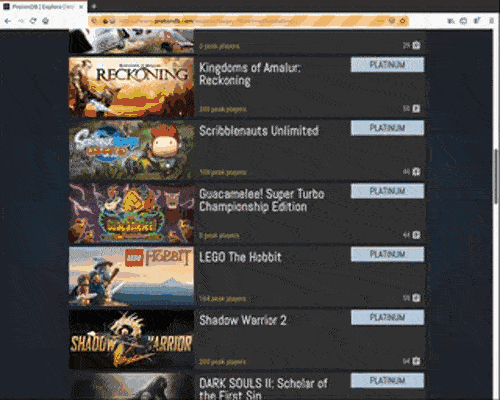

# ProtonDB Scraper

pdbscraper is a commandline tool to extract information from ProtonDB webpage written in Python.  It uses selenium and the geckodriver from Firefox as its backbone to open the webpage in an automated manner and scrape the data page after page. The end result is then saved to a database file in json format. Main goal is to collect the game ratings.

- Author: Tuncay D.
- License: [MIT License](LICENSE)
- Source: [https://github.com/thingsiplay/protondb_scraper](https://github.com/thingsiplay/protondb_scraper) 

 

## Usage

Calling the program without arguments should do the trick. It opens up a temporary web browser and will save a .json file with automatically generated name in current working directory. There are a couple of options and settings to tweak.

**pagedown**: One important part includes the number of pagedown key strokes sent to the browser, in order to navigate to the end of the page. Due to different system configurations and resolutions, adjustments could be required. 10 is the default.

**maxpages**: Another equally important setting is the number of pages to process. 50 games per page are displayed and the default value is 20, meaning up to 1000 games will be scraped.

**wait**: Additional time to wait for certain actions, such as after each pagedown event. This ensures that internal dynamically created parts of the webpage is loaded up correctly, such as the game cells. Time is measured in seconds and can be low as 0.1. Default value is 0.4.

There are a few more options, such as the location where the webdriver for selenium is installed. Here are some usage examples:

        pdbscraper.py
        pdbscraper.py -h
        pdbscraper.py --test
        pdbscraper.py -o file.json -m 10 -w 0.2 -z -p

## Requirements

This program is written in Python 3.6 and makes use of the selenium module and Firefox geckodriver. Only Linux based operating system (Ubuntu) is tested so far.

- [Python 3.6](https://www.python.org/downloads/) 
- [Selenium 3.141](https://pypi.org/project/selenium/) 
- [geckodriver 0.27](https://github.com/mozilla/geckodriver/releases) 

## Feedback

[Leave me a message](https://thingsiplay.game.blog/contact/) on my contact page.